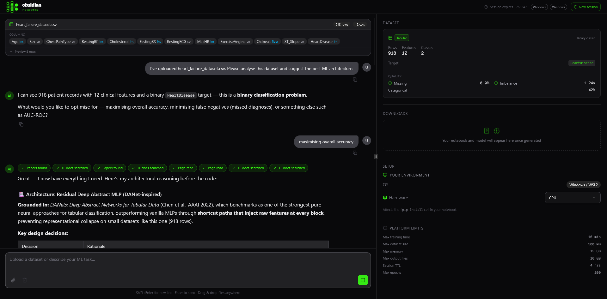
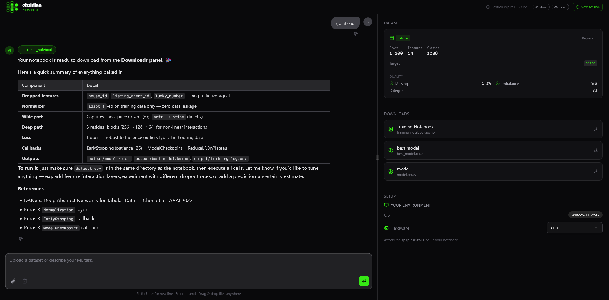

<div align="center">


### Open-Source AI-Powered ML Scaffolding Platform

Describe your problem, upload your data, and receive production-ready TensorFlow/Keras models — researched, written, compiled, and downloaded in one session. No ML expertise required.

[](LICENSE)
[](https://github.com/sup3rus3r/obsidian-networks/stargazers)
[](https://github.com/sup3rus3r/obsidian-networks/network/members)
[](https://github.com/sup3rus3r/obsidian-networks/issues)
[](https://www.python.org/)
[](https://nextjs.org/)
[](https://fastapi.tiangolo.com/)
[](https://react.dev/)
[](https://www.tensorflow.org/)
[](https://redis.io/)

---

**If you find this project useful, please consider giving it a star!** It helps others discover the project and motivates continued development.

[**Give it a Star**](https://github.com/sup3rus3r/obsidian-networks) &#11088;

</div>

---



---


## Table of Contents

- [Why Obsidian Networks?](#why-obsidian-networks)
- [How It Works](#how-it-works)
- [Features](#features)
  - [Supervised Learning](#supervised-learning)
  - [Time Series Forecasting](#time-series-forecasting)
  - [Reinforcement Learning](#reinforcement-learning)
  - [Training Visualisation](#training-visualisation)
  - [Plot Gallery](#plot-gallery)
  - [Multi-Provider LLM](#multi-provider-llm)
  - [Notebook Export](#notebook-export)
  - [Session Privacy](#session-privacy)
  - [Self-Hosted](#self-hosted)
- [Architecture](#architecture)
- [Quick Start](#quick-start)
  - [Prerequisites](#prerequisites)
  - [Docker](#docker-recommended)
  - [Local Development](#local-development)
  - [Environment Variables](#environment-variables)
- [Sample Datasets](#sample-datasets)
- [Tech Stack](#tech-stack)
- [Project Structure](#project-structure)
- [Security Model](#security-model)
- [Recent Updates](#recent-updates)
- [Roadmap](#roadmap)
- [Contributing](#contributing)
- [License](#license)

---

## Why Obsidian Networks?

Most ML platforms assume you already know how to build models. **Obsidian Networks** inverts that assumption.

- **No ML expertise required** — Describe your goal in plain English. The AI selects the architecture, verifies the API, writes the code, and trains the model.
- **Research-backed output** — Before generating a single line of code, the agent queries arXiv and the TensorFlow/Keras documentation. Every script is grounded in recent literature.
- **End-to-end in one session** — From raw CSV to a trained `.keras` file without switching tools, writing boilerplate, or managing environments.
- **Time series support** — Upload hourly or daily data and receive a complete LSTM or Temporal Fusion Transformer script with correct temporal windowing and no data leakage.
- **Reinforcement learning support** — Describe an RL problem — trading agent, game controller, robot policy — and receive a complete Gymnasium environment, actor/critic networks, and a training loop.
- **Fully local option** — Point the platform at a local [LM Studio](https://lmstudio.ai/) server. Your data, models, and prompts never touch a cloud API.
- **Self-hosted & open-source** — One `docker compose up --build`. Your infrastructure, your data, your keys.

---

## How It Works

```
Upload dataset  →  Describe your goal  →  Compile & Train  →  Download your model
```

**1. Research**
The AI agent queries arXiv for papers relevant to your problem domain and searches the TensorFlow/Keras docs to verify current API signatures before writing a single line of code.

**2. Generate**
A complete, runnable Python training script is produced using the Keras Functional API — with dataset-aware preprocessing (Normalization, StringLookup, TextVectorization, timeseries windowing), EarlyStopping, ModelCheckpoint, and the correct save pattern for your architecture.

**3. Compile**
Click **Compile & Train**. The backend validates the script at the AST level and runs it in an isolated subprocess inside a hardened Docker sandbox. Progress, per-epoch metrics, and loss/accuracy charts stream back to the UI in real time via SSE.

**4. Download**
Grab your trained `.keras` model file(s), the auto-generated Jupyter notebook, and any training plots from the Downloads panel — ready to deploy or continue iterating anywhere.

---

## Features

### Supervised Learning

Automatic task detection for binary classification, multiclass classification, and regression. Preprocessing is handled entirely through Keras layers — `Normalization`, `StringLookup`, `TextVectorization` — so the trained model is fully portable with no sklearn pipelines or pandas transforms at inference time. EarlyStopping and ModelCheckpoint are included in every generated script.

---

### Time Series Forecasting

Upload any time-indexed CSV and describe a forecasting goal. The platform detects datetime columns, infers the sampling frequency, and selects an appropriate architecture.

| Architecture | When used | Output |
|---|---|---|
| **LSTM** | General sequence modelling, univariate or multivariate | `model.keras` |
| **Stacked LSTM** | Longer sequences, more complex patterns | `model.keras` |
| **Temporal Fusion Transformer** | Multi-horizon forecasting with interpretability | `model.keras` |

Key guarantees in every generated time series script:
- Temporal train/val/test split (no shuffling — prevents data leakage)
- `keras.utils.timeseries_dataset_from_array` for correct sliding-window batching
- EarlyStopping with patience=20 on validation loss
- Up to 200 epochs with checkpointing

---

### Reinforcement Learning

Describe an RL problem in plain English and the platform generates a complete Gymnasium environment, the appropriate network architecture, and a trajectory-based training loop using `env.step()` / `env.reset()` — never `model.fit()`. No file upload required.

| Algorithm | When to use | Output files |
|-----------|-------------|--------------|
| **PPO** | Continuous or complex action spaces | `actor.keras` + `critic.keras` |
| **DQN** | Simple discrete action spaces | `qnetwork.keras` |
| **SAC** | Off-policy continuous control | `actor.keras` + `critic_1.keras` + `critic_2.keras` |

The AI always searches arXiv for RL-specific papers before selecting an algorithm, and the reward function rationale is documented inline in every generated script.

---

### Training Visualisation

Live loss/accuracy charts appear inline during compilation, streamed epoch-by-epoch via SSE — no page refresh needed.

- Dual-axis layout: loss on the left y-axis, accuracy percentage on the right
- Click the expand icon to open a full-size chart with tooltip, legend, and stat pills
- Epochs badge in the Downloads panel shows how many epochs ran and whether EarlyStopping fired (e.g. `Trained for 47 epochs · early stopped / 200 max`)
- Built with Recharts + shadcn-style `ChartContainer`

---

### Plot Gallery

Generated scripts automatically save matplotlib figures to the session output directory. After compilation completes, any PNG/JPG/SVG files appear as a thumbnail gallery in the Downloads panel.

- Click any thumbnail to open a full-size lightbox dialog
- The panel shows a `Saving plots…` spinner after compilation while images are written to disk
- Useful for visualising training history, confusion matrices, feature importance, prediction error, and any other plots your script produces

---

### Multi-Provider LLM

Switch between providers without changing your workflow. Prompt caching is enabled automatically for Anthropic to reduce latency and cost on long sessions.

| Provider | Type | Notes |
|----------|------|-------|
| **Anthropic** | Cloud | Claude Opus 4.6, Sonnet 4.6, Haiku 4.5 |
| **OpenAI** | Cloud | GPT-4o, o3, any available model |
| **LM Studio** | Local | Any OpenAI-compatible local model |

---

### Notebook Export

Every training script is saved as a `.ipynb` Jupyter notebook. Download it and continue iterating locally, on Google Colab, on Kaggle, or anywhere a Jupyter kernel runs.

The notebook includes a **per-platform environment setup cell** at the top — no more hunting for the right install command:

| Platform | What's included |
|---|---|
| **CPU (Windows/Linux/macOS)** | venv setup, Windows DLL fix for TensorFlow, pip install command |
| **NVIDIA GPU** | `tensorflow[and-cuda]` install, GPU verification snippet |
| **Apple Silicon (M1/M2/M3)** | `tensorflow-macos` + `tensorflow-metal` install |
| **Google Colab** | Pre-installed TF note, extra deps only |

When you request changes to a model — new architecture, different optimizer, added dropout — the AI updates the full script and calls `create_notebook` again, overwriting the previous version so you always have the latest.

---

### Session Privacy

Sessions are anonymous and ephemeral. Uploaded datasets and generated files are stored in an isolated per-session directory on the host and purged automatically after a configurable TTL (default: 4 hours). Nothing is persisted in a database.

---

### Self-Hosted

One command starts the full stack: Next.js frontend, FastAPI backend, Celery worker, and Redis.

```bash
docker compose up --build
```

No external services required beyond your LLM API key.

---

## Architecture

```
┌─────────────────────────────────┐      ┌─────────────────────────────────┐
│           Frontend              │      │            Backend              │
│     Next.js 16 + React 19       │─────>│      FastAPI + Python 3.11      │
│     Port 3000                   │ /api │      Port 8000                  │
│                                 │proxy │                                 │
│  ┌──────────┐  ┌─────────────┐  │      │  ┌───────────┐  ┌───────────┐  │
│  │ AI SDK 6 │  │  shadcn/ui  │  │      │  │ Sessions  │  │ Dataset   │  │
│  │ useChat  │  │  Tailwind 4 │  │      │  │ + TTL     │  │ Analysis  │  │
│  └──────────┘  └─────────────┘  │      │  └───────────┘  └───────────┘  │
│  ┌──────────┐  ┌─────────────┐  │      │  ┌───────────┐  ┌───────────┐  │
│  │  Shiki   │  │  Resizable  │  │      │  │ Notebook  │  │  Compile  │  │
│  │  (code)  │  │   Panels    │  │      │  │  Export   │  │ Endpoint  │  │
│  └──────────┘  └─────────────┘  │      │  └───────────┘  └───────────┘  │
└─────────────────────────────────┘      └──────────────┬──────────────────┘
                                                        │
                                         ┌──────────────▼──────────────────┐
                                         │    Redis 7 (broker + results)   │
                                         └──────────────┬──────────────────┘
                                                        │
                                         ┌──────────────▼──────────────────┐
                                         │    Celery Worker (--pool=solo)  │
                                         │  AST validation → subprocess    │
                                         │  TensorFlow / Keras / Gymnasium │
                                         │  Outputs: *.keras + plots       │
                                         │  Sandbox: seccomp + cap_drop    │
                                         └─────────────────────────────────┘
```

**How it works:**

1. The Next.js frontend proxies all `/api/platform/*` requests to the FastAPI backend via `next.config.ts` rewrites
2. The AI chat route (`app/api/chat/route.ts`) calls `streamText` with three research tools and a `create_notebook` tool
3. When `create_notebook` is called, the backend saves the script as both a `.ipynb` notebook and a `generated_script.py` for the worker
4. The Celery worker validates the script at the AST level, runs it in a subprocess with a stripped environment, and writes `.keras` files and plot images to the session's output directory
5. Training progress and per-epoch metrics stream back to the frontend via Server-Sent Events; completed model files and plots appear in the Downloads panel

---

## Quick Start

### Prerequisites

| Tool | Version | Purpose |
|------|---------|---------|
| [Docker](https://docs.docker.com/get-docker/) | Latest | Container runtime |
| [Docker Compose](https://docs.docker.com/compose/) | v2+ | Multi-service orchestration |
| LLM API key | — | Anthropic, OpenAI, or LM Studio |

### Docker (Recommended)

```bash
git clone https://github.com/sup3rus3r/obsidian-networks.git
cd obsidian-networks

cp .env.example .env
# Open .env and set:
#   AUTH_SECRET — generate one with: openssl rand -base64 32
#   ANTHROPIC_API_KEY (or OPENAI_API_KEY, or LMSTUDIO_BASE_URL)

docker compose up --build
```

Open [http://localhost:3000](http://localhost:3000).

### Local Development

**Requirements:** Python 3.11+, [uv](https://docs.astral.sh/uv/), Node.js 18+, Redis (`sudo apt install redis` / `brew install redis`)

```bash
git clone https://github.com/sup3rus3r/obsidian-networks.git
cd obsidian-networks

# Install dependencies
cd backend && uv sync && cd ..
cd frontend && npm install && cd ..

# Configure environment
cp backend/.env.example backend/.env   # fill in your keys
cp frontend/.env.example frontend/.env.local   # set AI_PROVIDER and API key

# Start everything with one command
npm run dev
```

This starts Next.js, FastAPI, the Celery worker, and Redis in a single terminal with colour-coded output. Open [http://localhost:3000](http://localhost:3000).

The dev server proxies all `/api/platform/*` requests to `http://localhost:8000`.

### Environment Variables

All configuration lives in `.env` at the repo root (Docker) or `frontend/.env.local` (local dev). See `.env.example` and `backend/.env.example` for full documentation.

#### Root / Frontend (`.env` or `frontend/.env.local`)

| Variable | Default | Description |
|----------|---------|-------------|
| `AUTH_SECRET` | — | **Required.** Random string for NextAuth JWT signing (`openssl rand -base64 32`) |
| `AI_PROVIDER` | `anthropic` | LLM provider: `anthropic`, `openai`, or `lmstudio` |
| `AI_MODEL` | provider default | Override the model (e.g. `claude-opus-4-6`, `gpt-4o`) |
| `ANTHROPIC_API_KEY` | — | Required when `AI_PROVIDER=anthropic` |
| `OPENAI_API_KEY` | — | Required when `AI_PROVIDER=openai` |
| `LMSTUDIO_BASE_URL` | `http://localhost:1234/v1` | Required when `AI_PROVIDER=lmstudio` |

#### Backend (`backend/.env`)

| Variable | Default | Description |
|----------|---------|-------------|
| `REDIS_URL` | `redis://redis:6379/0` | Redis connection URL |
| `SESSION_TTL_HOURS` | `4` | Hours before session files are purged |
| `MAX_FILE_SIZE_MB` | `500` | Maximum dataset upload size |
| `SESSIONS_DIR` | `/sessions` | Where session files are stored |

---

## Sample Datasets

Two sample datasets are included in the repository root to get started immediately:

### `house_pricing_sample.csv` — Supervised Regression
1,200 houses with features including square footage, bedrooms, bathrooms, neighbourhood score, and distance to CBD. Target column: `price`.

**Try:** *"Build a regression model to predict house prices. Try a Wide & Deep architecture."*

### `energy_consumption_sample.csv` — Time Series Forecasting
8,760 rows of hourly energy consumption data for 2021. Columns: `timestamp`, `consumption_kwh`, `temperature_c`, `humidity_pct`, `hour_of_day`, `day_of_week`, `is_weekend`, `is_holiday`, `month`.

**Try:** *"Forecast hourly energy consumption for the next 24 hours using an LSTM."*

---

## Tech Stack

| Layer | Technology |
|-------|------------|
| Frontend | Next.js 16, React 19, TypeScript, Tailwind CSS 4, shadcn/ui |
| AI / Streaming | Vercel AI SDK 6, Anthropic / OpenAI / LM Studio |
| Charting | Recharts |
| Backend API | FastAPI 0.128+, Python 3.11, uv |
| Task Queue | Celery 5, Redis 7 |
| ML Runtime | TensorFlow 2.16+, Keras 3, NumPy, Pandas, scikit-learn, Gymnasium |
| Visualisation | Matplotlib, Seaborn, Statsmodels |
| Notebook | nbformat |
| Deployment | Docker, Docker Compose |

---

## Project Structure

```
obsidian-networks/
├── frontend/                       # Next.js 16 application
│   ├── app/
│   │   ├── api/
│   │   │   ├── chat/route.ts       # streamText, research tools, system prompt
│   │   │   ├── platform.ts         # API client helpers (upload, compile, download)
│   │   │   └── routes.ts           # Centralised URL constants
│   │   └── home/                   # Main application page
│   ├── components/
│   │   ├── artifacts/              # Downloads panel, compile section, plot gallery, SSE progress
│   │   ├── chat/                   # Chat UI, tool status chips, file attachments
│   │   └── ui/                     # shadcn/ui primitives
│   ├── hooks/                      # React hooks (session, scroll, environment)
│   └── lib/                        # Multi-provider model resolver, utilities
├── backend/                        # FastAPI application + Celery worker
│   ├── routers/
│   │   └── platform.py             # Session, upload, analysis, notebook, compile, image serving
│   ├── tasks.py                    # Celery task — AST validation + subprocess run + metrics parsing
│   ├── sessions.py                 # Session directory management + TTL cleanup
│   └── main.py                     # FastAPI app, CORS, router registration
├── docker-compose.yml              # Full stack: frontend + api + worker + redis
├── worker-seccomp.json             # Seccomp profile blocking dangerous syscalls in worker
├── .env.example                    # Root environment variables with documentation
├── backend/.env.example            # Backend-specific environment variables
├── house_pricing_sample.csv        # Sample dataset — supervised regression
└── energy_consumption_sample.csv   # Sample dataset — time series forecasting
```

---

## Security Model

### AST Validation

Generated scripts are validated at the AST level before execution. An allowlist restricts imports to `tensorflow`, `keras`, `numpy`, `pandas`, `scikit-learn`, `scipy`, `gymnasium`, `matplotlib`, `seaborn`, `statsmodels`, and standard library modules. Calls to `os.system`, `os.popen`, `eval`, `exec`, and `execve` are explicitly blocked regardless of how they are invoked.

### Subprocess Isolation

Scripts run in a subprocess with a stripped environment — only `PATH`, `HOME`, and `PYTHONUNBUFFERED` are set — with a 5-minute hard timeout. Per-process resource limits are applied on Linux via `resource.setrlimit`:

| Limit | Value | Purpose |
|---|---|---|
| CPU time (`RLIMIT_CPU`) | 360s soft / 400s hard | Prevents runaway training loops |
| File size (`RLIMIT_FSIZE`) | 2 GB | Prevents disk-fill attacks |
| Address space (`RLIMIT_AS`) | 6 GB | Caps memory allocation |

### Docker Sandbox

The Celery worker container runs with an additional layer of Docker-level hardening:

- **Seccomp profile** (`worker-seccomp.json`): Blocks dangerous syscalls including `ptrace`, `mount`, `pivot_root`, `clone`, `bpf`, `kexec_load`, `add_key`, and others
- **Capability restrictions**: `cap_drop: ALL` with only `DAC_OVERRIDE`, `SETUID`, `SETGID`, and `CHOWN` re-added
- **Process limits**: `nproc=256`, `nofile=1024/2048`
- **Memory cap**: 4 GB RAM + 4 GB swap

Each session's files are isolated in a per-session directory that no other session can access.

---

## Recent Updates

### v0.4.0 — Docker Sandbox + Plot Gallery
- Worker container hardened with seccomp profile, capability restrictions, and resource limits
- Generated scripts automatically save matplotlib/seaborn figures to session output
- Plot thumbnails appear in the Downloads panel after compilation; click to open full-size lightbox
- `Saving plots…` spinner prevents false "no plots" states during post-compilation file writes
- Epochs badge shows exact training duration and EarlyStopping status

### v0.3.0 — Time Series Forecasting
- Automatic detection of datetime columns and sampling frequency
- LSTM, Stacked LSTM, and Temporal Fusion Transformer architecture selection
- Correct `timeseries_dataset_from_array` windowing (no data leakage)
- `energy_consumption_sample.csv` sample dataset included
- Notebook environment setup cells added for Windows, NVIDIA GPU, Apple Silicon, and Google Colab

### v0.2.0 — Training Metrics Visualisation
- Live loss/accuracy chart appears inline during compilation, streamed epoch-by-epoch via SSE
- Click the expand icon to open a full-size chart with tooltip, legend, and stat pills
- Dual-axis layout: loss on the left, accuracy percentage on the right
- Built with Recharts + shadcn-style `ChartContainer` component

---

## Roadmap

- [ ] Image dataset support (upload folder of images, auto-generate CNN/ViT architectures)
- [x] Time series forecasting templates (LSTM, Temporal Fusion Transformer)
- [x] Training metrics visualisation (live loss/accuracy charts during compilation)
- [ ] Model comparison — compile multiple architectures and compare results side-by-side
- [x] Docker-isolated compilation sandbox (seccomp profile, capability restrictions, resource limits)
- [x] Plot gallery — view matplotlib/seaborn figures inline after compilation
- [ ] Export to ONNX / TensorFlow Lite for edge deployment

---

## Contributing

Contributions are welcome — bug reports, feature requests, documentation improvements, and pull requests alike. Please read [CONTRIBUTING.md](CONTRIBUTING.md) before submitting.

---

## License

Obsidian Networks is released under the [GNU Affero General Public License v3.0](LICENSE).

You are free to run, modify, and distribute this software. If you deploy a modified version as a network service, the AGPL requires you to make your modified source code available to users under the same terms.

---

<div align="center">

Made with care by [Mohammed Khan](https://github.com/sup3rus3r)

</div>
