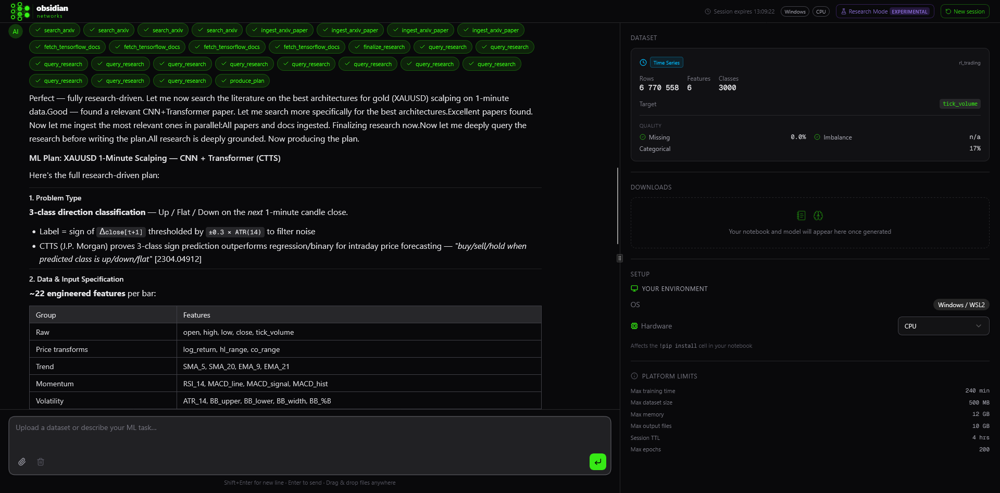
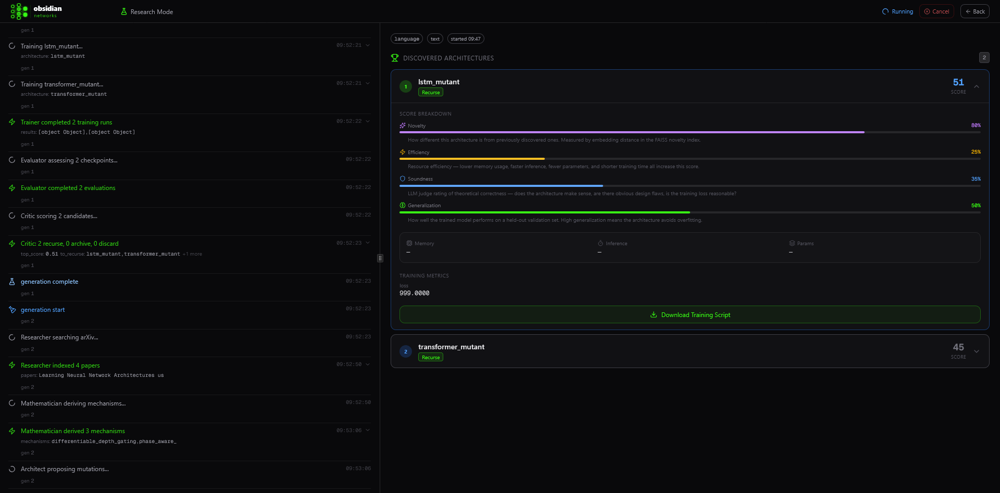

<div align="center">


---

Obsidian Networks is an open-source platform that takes a problem described in plain language and builds a working ML solution from it — reading the relevant research, selecting an architecture, writing and running the code, and returning something you can actually use.

You describe the problem. It handles the rest: literature search, architecture selection, code generation, training, debugging. The output is a trained model and a Jupyter notebook you can open and modify.

It runs entirely on your own hardware. No data leaves your machine. No API calls to a training service. No account required beyond whatever LLM provider you choose to use.

Autonomous Research Mode goes further — instead of solving one problem, it runs an open-ended architecture search. Eight agents work in a loop across multiple generations: generating candidates, training them, scoring them, and recursing on the ones worth keeping. You set a domain and a goal, and it runs until it has something to show you.

**Built in pursuit of AGI. Open source under AGPL v3.**

---

[](LICENSE)
[](https://github.com/sup3rus3r/obsidian-networks/stargazers)
[](https://github.com/sup3rus3r/obsidian-networks/network/members)
[](https://github.com/sup3rus3r/obsidian-networks/issues)
[](https://www.python.org/)
[](https://nextjs.org/)
[](https://fastapi.tiangolo.com/)
[](https://www.tensorflow.org/)
[](https://redis.io/)

---

**If you find this project useful, please consider giving it a star!** It helps others discover the project and motivates continued development.

[**Give it a Star ⭐**](https://github.com/sup3rus3r/obsidian-networks)

</div>

---

## Screenshots

<div align="center">

**Main Platform — Research, Plan, Build**



*The platform reads academic literature, forms a cited plan, and generates a production training script — all in one conversation.*

</div>

<div align="center">

**Autonomous Research Mode — Discovered Architectures Leaderboard**



*Eight agents run continuously, scoring each candidate on novelty, efficiency, soundness, and generalisation. Top performers seed the next generation.*

</div>

---

## How It Works

You describe what you need. Everything else happens automatically.

**Research** — The platform goes to the source. It searches academic literature, reads papers, selects the ones that matter for your specific problem, and builds a private knowledge base from them — just for this session. It does not guess. It does not improvise from memory. It reads.

**Plan** — From that knowledge base, it forms a plan. Every decision — what approach to take, how to structure it, what to measure — is drawn from what it found in the literature and presented to you with citations. You read it. You approve it. Nothing is built until you do.

**Build** — Once you give the go-ahead, it builds exactly what was planned. The output is clean, readable, and yours to keep — a complete working script wrapped in a Jupyter notebook you can open anywhere.

**Train** — Click one button. It runs on your machine, in your environment. You watch it work in real time — metrics, charts, progress — as it trains. When it finishes, you download the result.

That is the whole process. No configuration. No expertise required. No waiting on someone else.

---

## Autonomous Research Mode

Beyond building a single model, Obsidian Networks includes an Autonomous Research Mode — a multi-generation architecture discovery engine that searches an entire design space on your behalf, grounded in real academic research at every step.

You set a domain (vision, text, audio, time series, graph, multimodal, tabular, recommendation, or generative), a research goal in plain language, and how many candidates and generations to run. Eight specialised AI agents then execute in a coordinated pipeline:

### The Pipeline

**1. Researcher** — Uses an LLM to generate targeted arXiv search queries from your specific research goal — not generic domain keywords. The model reads your goal, considers what has failed in previous generations, and writes queries designed to find papers that are actually relevant. It then reads the abstracts, selects the 3–4 most relevant papers, downloads the full PDFs, extracts the complete text (methods sections, equations, pseudocode, results), and chunks it into a per-session FAISS vector store. Papers accumulate across generations, so later generations have a richer store to draw from.

**2. Mathematician** — Queries the session vector store with targeted questions about mathematical mechanisms, attention formulations, loss functions, and novel training objectives. Gets back actual content from the papers — real equations and methods sections — not abstract summaries. Derives concrete mechanisms with names, descriptions, and symbolic expressions in SymPy syntax (e.g. `softmax(Q_t @ K_t.T / sqrt(d)) @ V_t`), validated against the SymPy library to ensure they are real mathematics, not hallucinations.

**3. Architect** — Takes the validated mechanisms and proposes architecture mutations against base domain templates (CNNs, Transformers, LSTMs, GANs, GNNs, etc.). Crucially, it knows which mutation combinations have already failed in previous generations and is explicitly instructed to avoid repeating them.

**4. Coder** — Generates a complete, self-contained TensorFlow/Keras training script for each proposed architecture. The mathematical mechanisms derived from the papers are embedded directly into the code prompt — not just described, but actually implemented as mathematical operations where architecturally appropriate.

**5. Trainer** — Runs each generated script in an isolated subprocess. Captures training metrics, hardware usage, parameter counts, and training time. Automatically diagnoses and retries on recoverable failures (syntax errors, import issues, dimension mismatches).

**6. Evaluator** — Loads the trained checkpoint and evaluates it on held-out synthetic test data appropriate for the domain. Returns domain-specific metrics: accuracy for classification, MSE for regression and forecasting, reconstruction loss for generative models, node accuracy for graphs.

**7. Validator** — Checks each architecture against multiple soundness dimensions: output shape correctness, parameter count, generalisation gap between training and validation loss, inference speed. Flags architectures that trained successfully but have fundamental structural problems.

**8. Critic** — Scores every candidate on four axes: **Novelty** (how different is this from known base templates?), **Efficiency** (parameter count and inference speed relative to performance), **Soundness** (architectural correctness and stability), **Generalization** (gap between training and validation loss). Decides which candidates are worth recursing on in the next generation.

### How Generations Work

After each generation, the top-scoring candidates seed the next one — the Architect prioritises their base templates and the Mathematician derives new mechanisms to push them further. Candidates that scored poorly are recorded as **failure patterns** (name, mutations tried, score, reason) and passed forward so the Architect never repeats the same dead ends.

If a generation produces no candidates worth recursing on, the session does not start from scratch. Instead it seeds the next generation from the best candidate found so far — even if it scored poorly — so the Architect continues building on that structural direction rather than exploring blind. The Researcher fetches fresh papers and the Mathematician derives new mechanisms, giving the architecture a new mathematical angle without losing the progress already made.

After three consecutive generations without a strong candidate, the session pauses and asks you whether to keep going or stop. If you continue, the failure counter resets and exploration resumes with the same best-so-far seed. If you stop, the session closes and you keep whatever was found. You control both the number of candidates per generation and the maximum number of generations, either via slider (up to 20) or by typing any number directly.

### Research Lineage

Every candidate card shows its full research lineage: which papers informed the design, what mathematical mechanisms were derived from them (including their SymPy expressions), and the rationale for why those specific mutations were proposed. This is not post-hoc explanation — the papers and mechanisms are the actual inputs to the code generator.

### What You See

A live feed of agent activity as each generation runs. When it completes, a ranked leaderboard of discovered architectures with score breakdowns, training metrics, and research lineage. Every architecture is downloadable as a production training script.

This is architecture search that used to require a dedicated research team and months of ablation studies. Now it runs overnight on your own hardware.

---

## What You Can Solve

**Prediction from data** — If you have a spreadsheet and a question — who will churn, what will sell, which patient is at risk, when will the part fail — upload it, describe what you want to know, and get a working model. No ML background needed.

**Forecasting over time** — If your data has a time dimension and you need to see what comes next, the platform handles the complexity of temporal modelling correctly. No data leakage. No manual windowing. Just describe the goal.

**Decision-making and control** — Describe a problem where something needs to learn to act — a trading strategy, a controller, an agent that optimises a process — and receive a complete environment and training loop built around it.

**Vision and video** — Describe what you need to see or detect. The platform asks the right questions, understands your constraints, and builds the architecture to match. No dataset upload required — just a clear description of the problem.

**Language and understanding** — From text classification to attention-based architectures for complex language tasks, built on current research rather than dated templates.

**Generation** — If the goal is to create rather than predict — synthetic data, novel images, learned representations — the platform builds the right generative architecture for it.

---

## Real-World Use Cases

**Early warning in a hospital ward.** Nurses document vitals and lab results every shift. Nobody has time to read all of it. Upload the EHR export, describe what deterioration looks like in your cohort, and get a model that flags the patients most likely to crash overnight — built on the sepsis prediction literature, trained on your data, not some generic benchmark.

**Predictive maintenance without the ML team.** Three years of vibration and temperature sensor logs from a production line. The failures are in there — they always were. Describe what a failure event looks like and the platform finds the temporal patterns that precede it, handles the lag windows correctly, and hands back something the maintenance team can actually use.

**Credit risk that doesn't stop at logistic regression.** There's always more signal in the data than a linear model can reach. Upload the application features, describe what default looks like, and get a deep tabular model trained on current research — with a full methodology writeup that explains every decision, ready to go in front of a risk committee.

**Climate forecasting on a small team's budget.** Thirty years of regional precipitation readings and a multi-step forecasting question that keeps getting pushed back because nobody has time to implement it properly. Describe the horizon and the spatial structure. The platform reads the literature, picks the right architecture, handles the windowing, and trains. What was sitting in a backlog for two years gets done in an afternoon.

**Gene expression classification with 20,000 features and 400 samples.** Most tools don't handle this well — they ignore the dimensionality problem or the class imbalance or both. Describe the tissue classes and the known imbalance. The platform finds the papers that specifically address this setup and builds accordingly.

**Recommendations that don't collapse on new users.** No interaction history, no embeddings, nothing to work from. Cold start is a solved problem in the research literature but a hard one to implement from scratch. Describe the constraint, describe the content, and get an architecture built around it rather than one that just pretends the problem doesn't exist.

**Finding a better execution policy without a six-week ablation study.** You have a working approach but suspect there's something better. Set a research goal in Autonomous Research Mode, point it at the RL domain, and let it run. Eight agents generate candidates, train them, score them on novelty and efficiency, and recurse on the top performers. By morning there's a ranked leaderboard. The answer to "is there something better?" used to require a dedicated research sprint. Now it runs while you sleep.

---

## GPU Acceleration

Autonomous Research Mode runs on CPU by default. This is fine for exploring how the system works, but CPU training produces weak metrics — which means lower scores, less recursion, and a leaderboard that reflects infrastructure limits more than architecture quality. For real research runs, attach a GPU.

Three options are supported. Set the relevant variables in your `.env` file.

---

### Option 1 — Local GPU (NVIDIA)

If your machine has an NVIDIA GPU and [nvidia-container-toolkit](https://docs.nvidia.com/datacenter/cloud-native/container-toolkit/install-guide.html) installed:

**`.env`**
```env
TRAINING_DOCKER_IMAGE=obsidian-trainer:latest
RESEARCH_ARTIFACTS_DIR=/research_artifacts
```

**`docker-compose.yml`** — add this to the `research-worker` service:
```yaml
research-worker:
  deploy:
    resources:
      reservations:
        devices:
          - driver: nvidia
            count: all
            capabilities: [gpu]
```

Then rebuild:
```bash
docker compose up --build
```

---

### Option 2 — RunPod (Serverless Cloud GPU)

[RunPod](https://www.runpod.io) lets you run GPU jobs on demand and pay only for what you use. No idle cost between research sessions.

1. Create an account at [runpod.io](https://www.runpod.io)
2. Deploy a serverless endpoint using the Obsidian worker image
3. Copy your API key from **Settings → API Keys** and your endpoint ID from the serverless dashboard

**`.env`**
```env
RUNPOD_API_KEY=your_runpod_api_key
RUNPOD_ENDPOINT_ID=your_endpoint_id
```

No changes to `docker-compose.yml` needed.

---

### Option 3 — Lambda Labs (On-Demand Cloud GPU)

[Lambda Labs](https://lambdalabs.com) offers on-demand GPU instances at competitive rates.

1. Create an account at [lambdalabs.com](https://lambdalabs.com)
2. Generate an API key from **API Keys** in your dashboard

**`.env`**
```env
LAMBDA_API_KEY=your_lambda_api_key
```

No changes to `docker-compose.yml` needed.

---

### Priority Order

When a research session starts, the platform picks the first available provider in this order:

```
Local Docker GPU → RunPod → Lambda Labs → CPU fallback
```

CPU fallback always runs — it just produces limited training results. If you have cloud credentials set, they will be used automatically when a local GPU is not available.

---

## It Fixes Its Own Mistakes

Code fails sometimes. That is not a problem here. When something does not compile or run correctly, the platform diagnoses what went wrong, rewrites what it needs to, and tries again — on its own, without you having to do anything. You will see it happen in the chat. By the time you look back, it has usually already fixed it.

---

## Choosing an AI Provider

The platform works with Anthropic (Claude), OpenAI (GPT-4o), or any local model via LM Studio. From testing, Claude gives the best results — it reads more thoroughly, reasons more carefully, and produces cleaner output with less fixing needed. GPT-4o is a solid second. Local models work well at larger sizes; smaller ones occasionally skip research steps or need a retry.

If privacy matters most and you want everything running locally with no API costs, use LM Studio with the largest model your hardware supports. If you want the best output with minimal friction, use Claude.

---

## Quick Start

### What you need

| Tool | Purpose |
|------|---------|
| [Docker Desktop](https://www.docker.com/products/docker-desktop/) | Runs the entire platform in containers |
| [Git](https://git-scm.com/downloads) | To clone the repository |
| An LLM API key | Anthropic, OpenAI, or a local LM Studio server |

Docker Desktop includes everything needed on Windows and macOS. On Linux, install Docker Engine and Docker Compose separately.

### Step 1 — Clone and configure

```bash
git clone https://github.com/sup3rus3r/obsidian-networks.git
cd obsidian-networks

cp .env.example .env
```

Open `.env` in any text editor and fill in two things:
- `AUTH_SECRET` — a random string used to secure sessions. Generate one by running: `openssl rand -base64 32`
- Your API key — `ANTHROPIC_API_KEY`, `OPENAI_API_KEY`, or `LMSTUDIO_BASE_URL` depending on which provider you're using

### Step 2 — Start the platform

```bash
docker compose up --build
```

Open [http://localhost:3000](http://localhost:3000) in your browser.

### Local Development (without Docker)

If you prefer to run the stack directly on your machine — requires Linux or WSL2, Python 3.11+, Node.js 18+, and Redis installed locally:

```bash
git clone https://github.com/sup3rus3r/obsidian-networks.git
cd obsidian-networks

cd backend && pip install uv && uv sync && cd ..
cd frontend && npm install && cd ..

cp .env.example .env
npm run dev
```

This starts everything in one terminal with colour-coded output. Open [http://localhost:3000](http://localhost:3000).

---

## Environment Variables

All configuration lives in the `.env` file at the repo root.

| Variable | Default | What it does |
|----------|---------|--------------|
| `AUTH_SECRET` | — | **Required.** Secures session cookies. Generate with `openssl rand -base64 32` |
| `AI_PROVIDER` | `anthropic` | Which AI to use: `anthropic`, `openai`, or `lmstudio` |
| `AI_MODEL` | provider default | Override the specific model, e.g. `claude-sonnet-4-6` or `gpt-4o` |
| `ANTHROPIC_API_KEY` | — | Required when using Anthropic |
| `OPENAI_API_KEY` | — | Required when using OpenAI |
| `LMSTUDIO_BASE_URL` | `http://localhost:1234/v1` | Required when using LM Studio |
| `SESSION_TTL_HOURS` | `4` | How long before uploaded files and session data are automatically deleted |
| `MAX_FILE_SIZE_MB` | `500` | Maximum size of dataset uploads |
| `MAX_TRAINING_MINUTES` | `10` | How long a training job is allowed to run before being stopped |
| `MAX_MEMORY_GB` | `12` | Maximum memory the training worker can use |
| `MAX_EPOCHS` | `200` | Maximum number of training epochs any generated script can run |
| `NEXT_PUBLIC_UPLOAD_URL` | `http://localhost:8000` | The backend URL used for large file uploads. Change this to your server's public address when deploying |
| `TRAINING_DOCKER_IMAGE` | — | Local GPU: the Docker image used for training jobs (requires nvidia-container-toolkit) |
| `RESEARCH_ARTIFACTS_DIR` | `/research_artifacts` | Where training checkpoints and outputs are stored |
| `RUNPOD_API_KEY` | — | RunPod serverless GPU: API key from your RunPod dashboard |
| `RUNPOD_ENDPOINT_ID` | — | RunPod serverless GPU: endpoint ID from your RunPod serverless console |
| `LAMBDA_API_KEY` | — | Lambda Labs GPU: API key from your Lambda dashboard |
| `GPU_POLL_INTERVAL_S` | `15` | How often (in seconds) to check on remote GPU job status |

---

## Sample Datasets

Two datasets are included so you can try the platform immediately after setup.

**`heart_failure_dataset.csv`** — 918 patients with 11 clinical features including age, chest pain type, blood pressure, cholesterol, and ECG results. The goal is to predict whether a patient has heart disease.

Try: *"Build a binary classifier to predict heart disease. Use a deep neural network with dropout regularisation."*

**`energy_consumption_sample.csv`** — Hourly energy consumption readings over time. The goal is to forecast future consumption.

Try: *"Forecast energy consumption for the next 24 hours using an LSTM."*

---

## Tech Stack

| Layer | Technology |
|-------|------------|
| Frontend | Next.js 16, React 19, TypeScript, Tailwind CSS 4 |
| AI / Streaming | Vercel AI SDK 6, Anthropic / OpenAI / LM Studio |
| Backend API | FastAPI, Python 3.11 |
| Task Queue | Celery 5, Redis 7 |
| ML Runtime | TensorFlow 2.18+, Keras 3, NumPy 2.x, Pandas, scikit-learn, Gymnasium |
| Research | FAISS vector store, sentence-transformers, pypdf, arXiv API, Context7 |
| Research Mode | 8-agent autonomous loop, MongoDB, FAISS novelty index |
| Deployment | Docker, Docker Compose |

---

## Security

Generated scripts are checked for dangerous code before they ever run. Imports are restricted to a safe allowlist of known ML libraries. Calls to system commands, file execution, and anything that could affect your machine outside the sandbox are blocked.

Training runs happen inside an isolated subprocess with a hard time limit, a memory cap, and a file size limit. The worker container runs with additional Docker-level restrictions — blocked system calls, dropped Linux capabilities, and process limits — to prevent any generated code from escaping its sandbox.

Your uploaded files are stored in a private per-session directory that no other session can access, and everything is automatically deleted after the session expires.

---

## Contributing

Contributions are welcome — bug reports, feature requests, documentation improvements, and pull requests alike. Please read [CONTRIBUTING.md](CONTRIBUTING.md) before submitting.

---

## License

Obsidian Networks is released under the [GNU Affero General Public License v3.0](LICENSE).

You are free to run, modify, and distribute this software. If you deploy a modified version as a network service, the AGPL requires you to make your modified source code available to users under the same terms.

---

<div align="center">

Made with care by [Mohammed Khan](https://github.com/sup3rus3r)

</div>
